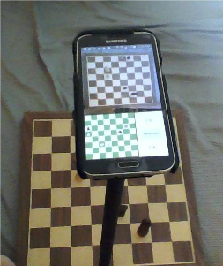

# Chessify
Smart chessboards cost hundreds of dollars. The goal of Chessify is to provide smart chessboard capabilities (tracking and analyzing games, automatic timer, etc.) with equipment that we already have. Chessify requires only a phone and a mount to rest the phone on.

Chessify does not uniquely identify pieces, instead it uses the known beginning state of a chess game and tracks piece movements. It mostly relies on performing edge detection and luminance variation on camera preview frames.

A picture of the setup

Chessify is currently under development, i.e. not yet released.

You can compile the code above and get out a chessboard. It should, but is not guaranteed to work on every device depending on camera and resolution details (development was on a Samsung Galaxy S5). It tracks pieces fairly robustly, especially when the mount is placed higher and perspective is minimised. 
